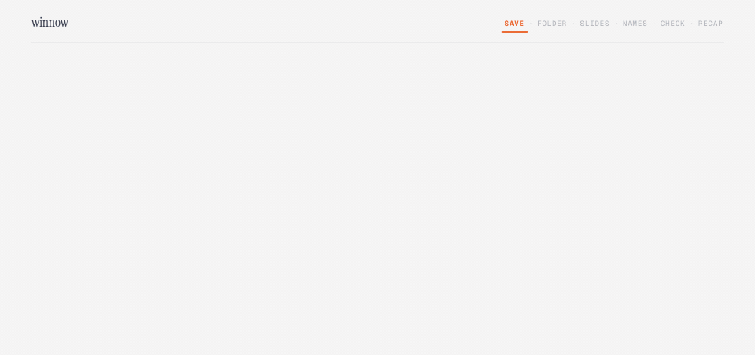
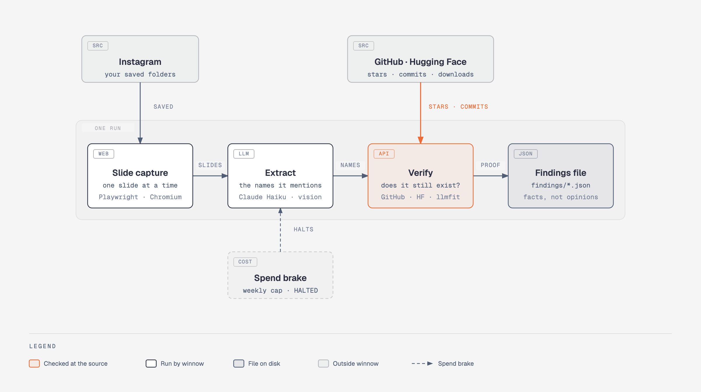
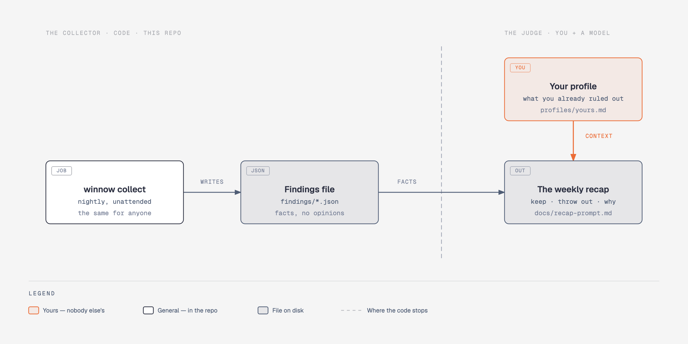

<div align="center">

# winnow

**You save a post on Instagram and forget it. winnow doesn't. Analytical tool to find, verify and resume what you need, aligned with your goals.**

[](LICENSE)
[](https://www.python.org/downloads/)
[](https://docs.pytest.org/)
[](CONTRIBUTING.md)


<sub>Jean-François Millet, <em>The Winnower</em>, c. 1847–48. National Gallery, London. Public domain.</sub>

</div>

---

## How it works

You save a post and forget it. Once a night winnow opens the ones you haven't
seen, **clicks through every slide of the carousel**, and writes down what the
post put on the table: a list gives up every entry, a piece of news gives up
what was announced. Whatever has a name — a repo, a model — is then **checked at
the source**: GitHub knows the real star count, the last commit, whether it's
archived. What survives lands in a file. Once a week you read the recap.

<p align="center"></p>

<picture>
  <source media="(prefers-color-scheme: dark)" srcset="assets/diagrams/winnow-pipeline-dark.png">
  
</picture>

> **A post is not a source. It's a pointer.**

A bait post that happens to contain a live repo with 37k stars **passes**.
A beautifully made post listing repos dead for two years **gets thrown out**.
The caption would never tell you which is which. The check does.

## Install

```bash
pipx install git+https://github.com/stek765/winnow
winnow init
```

`winnow init` does the rest: it creates the directories, writes a config file
for you to fill in, downloads the browser, and walks you through signing in.
Run it again any time — it reports where you stand instead of starting over.

```console
$ winnow init
----------------------------------------------------------
  ✅ configurazione       ~/.config/winnow/config.toml
  ❌ chiave API           assente
  ✅ browser              Chromium pronto
  ✅ accesso Instagram    ~/.local/share/winnow/browser-profile

  Manca ancora:
    • chiave API: crea una chiave su console.anthropic.com ...
```

Three things only you can do, and `init` will tell you when they are missing:

1. **Fill in the config** — your username and the path of each saved folder you
   want read. Open the folder on instagram.com and copy it from the address bar.
2. **An API key** — from `console.anthropic.com`. Set a spend limit there while
   you are at it; see [What it costs](#what-it-costs).
3. **Sign in** — `winnow login` opens a dedicated browser profile, separate
   from your everyday browser. winnow never types your password.

### Where things live

Nothing lives next to the code, so the command works from any directory:

| | |
|---|---|
| `~/.config/winnow/` | `config.toml`, and `env` holding your API key (mode 600) |
| `~/.local/share/winnow/` | state, findings, and the browser profile |

`winnow where` prints them. Both honour `XDG_CONFIG_HOME` / `XDG_DATA_HOME`,
or `WINNOW_CONFIG_DIR` / `WINNOW_DATA_DIR` if you want them somewhere else.

Write your profile too: copy [`profiles/esempio.md`](profiles/esempio.md) and
make it honest. Vague goals produce a vague filter.

## Use

```bash
winnow collect      # one pass -> findings/YYYY-MM-DD.json
winnow status       # this week's spend, or why it stopped
winnow reset-halt   # restart after a halt, deliberately
```

### Scheduling it

The scheduled job is just `winnow collect` — the key is read from
`~/.config/winnow/env`, so it never appears in the schedule definition and no
wrapper script is needed.

On macOS use **launchd**, not cron. On a laptop that sleeps, cron silently
skips a missed run and never mentions it — a 3 a.m. job would quietly never
fire. launchd catches up on wake.

```xml
<!-- ~/Library/LaunchAgents/dev.winnow.collect.plist -->
<key>ProgramArguments</key>
<array>
  <string>/Users/YOU/.local/bin/winnow</string>
  <string>collect</string>
</array>
<key>StartCalendarInterval</key>
<dict><key>Hour</key><integer>13</integer><key>Minute</key><integer>0</integer></dict>
<key>StandardOutPath</key>
<string>/Users/YOU/.local/share/winnow/state/collect.log</string>
<key>StandardErrorPath</key>
<string>/Users/YOU/.local/share/winnow/state/collect.log</string>
```

```bash
launchctl load ~/Library/LaunchAgents/dev.winnow.collect.plist
launchctl start dev.winnow.collect     # run it once now
```

Pick an hour the machine is usually awake and unlocked — the browser window
needs a graphical session. On Linux, a cron line does the same job.

Read the findings weekly — the recap prompt lives in
[`docs/recap-prompt.md`](docs/recap-prompt.md).

---

<sub>Everything below is the reasoning. The three sections above are all you need to run it.</sub>

## Why

You save posts because something caught your eye. Then you never go back.

And when you do, two things have gone wrong:

1. **Most of it is bait.** Not badly made — *deliberately* made to be saved and
   never to pay off.
2. **The useful part isn't in the text.** A post promises "9 repositories worth
   bookmarking" and its caption names **none of them**. The names live inside
   the eleven slides of the carousel, because the comments asking *"links
   please?"* are the point. That is the business model, not an accident.

So the tool has to open the slides, and it has to be suspicious.

## The loop

winnow runs on its own and hands you something to read once a week.

The daily half is a scheduled job — **launchd** on macOS, cron elsewhere. It
opens a real browser because Instagram does not welcome headless ones, so you
will see a window appear and vanish, and nothing asks you anything. What it leaves behind is one file: `findings/2026-08-20.json`.

The weekly half is you and a model reading those findings against your profile
([`docs/recap-prompt.md`](docs/recap-prompt.md)). That is where the value lands.
Nothing to install for it.

## Is it working?

One command tells you everything — whether it stopped, when it last ran, what
it found, and what it has cost:

```console
$ winnow status
stato        attivo
spesa 7gg    USD 0.0553
post visti   15
ultimo giro  20/08 18:29 (0h fa) — 8 post, 36 entita', 11 verificate
da leggere   1 file in findings/
```

It warns you when something is wrong rather than making you notice:

| You see | It means |
|---|---|
| `ultimo giro ... ⚠️ piu' di 36h fa` | the machine was off, or the schedule is broken |
| `⚠️ N post falliti` | some posts could not be read — details in the findings file |
| a wall of text about `HALTED` | it stopped itself on spend and **will not restart** until you say so |

Two more, when you want detail:

```bash
tail -20 state/collect.log     # what the last runs actually did
ls findings/                   # one file per day, waiting to be read
```

**Worth an alias**, since the command lives in the project's virtualenv:

```bash
alias winnow='~/path/to/winnow/.venv/bin/winnow'
```

## The thesis

> **How well it filters depends on how well you've written down who you are.**

winnow has two halves, and only one of them is code. The collector navigates,
reads slides, extracts and verifies; the judge weighs what it found against
your life. Everything to the left of the dashed line is in this repo.

<picture>
  <source media="(prefers-color-scheme: dark)" srcset="assets/diagrams/winnow-two-halves-dark.png">
  
</picture>

The judge reads a plain markdown file you write: your goals, the decisions
you've already made, **the things you already considered and rejected**. That
last part is what makes it sharp. A generic tool says *"new job platform, looks
interesting."* Yours says *"that's the fourth remote-freelance marketplace this
month — you ruled that category out in August, and the reason still holds."*

Without that file winnow is one more aggregator. With it, it's yours.

Every content aggregator filters by **topic**. This one filters by **person**.

## What it costs

Reading slides means reading images, and images cost tokens. With the defaults
(Claude Haiku, only posts you haven't seen before) expect roughly
**$0.50 per week**.

winnow keeps its own books and **stops permanently** if the weekly spend crosses
the threshold in `config.toml`. Not to save money — because a bill twenty times
the estimate isn't a price, it's a bug: a loop re-reading everything, a corrupt
state file. The brake exists to catch the bug.

> ⚠️ **Also set a hard spend limit on your API key**, in your provider's console.
> The internal brake is policed by the same program that might contain the bug.
> The external one isn't.

## Privacy

`config.toml`, `state/`, `findings/`, your profiles and the browser profile are
all in `.gitignore`. No personal data lives in the source, and a test enforces
it. Your saved posts never leave your machine except as slides sent to the
extraction model.

## Design notes

The reasoning behind every decision — and the ones deliberately not reopened —
is in [`docs/superpowers/specs/`](docs/superpowers/specs/). The build order is
in [`docs/superpowers/plans/`](docs/superpowers/plans/).

Nothing above is a screenshot. The two diagrams are checked in as source —
[`assets/diagrams/`](assets/diagrams/) holds the self-contained HTML each PNG
was rendered from, light and dark — and the animation is drawn by
[`assets/demo/build.py`](assets/demo/build.py), which emits one SVG per frame
and assembles them with ffmpeg. The numbers it shows are the real ones from the
run of 2026-08-20.

## License

MIT — see [LICENSE](LICENSE).
