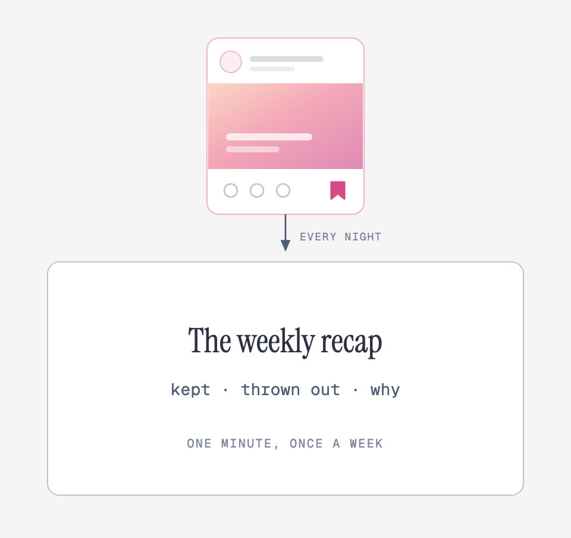
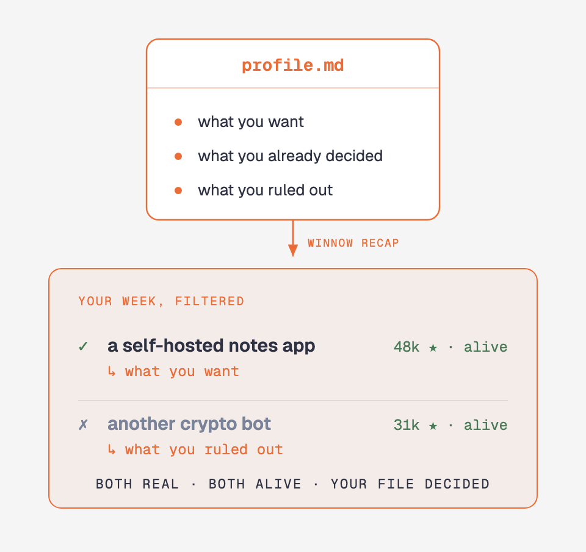

<div align="center">

# winnow

**You save a post on Instagram and forget it. winnow doesn't. Analytical tool to find, verify and resume what you need, aligned with your goals.**

[](LICENSE)
[](https://www.python.org/downloads/)
[](https://docs.pytest.org/)
[](CONTRIBUTING.md)


<sub>Jean-François Millet, <em>The Winnower</em>, c. 1847–48. National Gallery, London. Public domain.</sub>

</div>

<br>
<br>

## How it works

1. **You save a post** and forget it.
2. **Every night** winnow opens the new ones, reads **every slide of the
   carousel**, and checks each name it finds at the source — stars, last
   commit, archived or not. Facts only: it decides nothing.
3. **Once a week** `winnow recap` puts those facts next to **your profile**,
   and what comes back is about you, not about the topic.

<p align="center"></p>

## Overview Pipeline:

<picture>
  <source media="(prefers-color-scheme: dark)" srcset="assets/diagrams/winnow-pipeline-dark.png">
  
</picture>

<br> 

> A click-bait post that happens to name a live repo with 37k stars is worth
> keeping.
>
> A beautifully made post listing repos dead for two years is not.

The caption never tells you which is which — the check does. winnow throws
nothing away on its own: it records what it found and what the source said, and
the deciding happens once a week, [with your profile](#once-a-week).

## Install

```bash
pipx install git+https://github.com/stek765/winnow

winnow init
```

One command, six steps, about five minutes. It opens the pages you need, asks
you four questions, and does the rest itself. → [**the six steps**](#info)

## Commands

Five. Everything else `init` does for you.

| | |
|---|---|
| `winnow init` | set up, or fix whatever is missing |
| `winnow collect` | one pass now, instead of waiting for tonight |
| `winnow status` | is it alive, what did it find, what has it cost |
| `winnow recap` | the week + your profile, ready to paste into a model |
| `winnow reset-halt` | restart after the spend brake stopped it |


<br>
<br>

---

<br>

```console
$ winnow status                               (Example)
stato        attivo
spesa 7gg    USD 0.0553
programmato  ogni giorno alle 13:00 (launchd)
post visti   15
ultimo giro  20/08 18:29 (0h fa) — 8 post, 36 entita', 11 verificate
da leggere   1 file in findings/  →  winnow recap
```

`status` speaks up on its own when the last run is over 36h old, when posts
failed, or when the brake stopped it.

`winnow schedule --at 09:00 | --off`, `winnow login` and `winnow where` are
still there for when you want them directly.

## Once a week

<table>
<tr>
<td width="50%"></td>
<td width="50%"></td>
</tr>
<tr>
<td valign="top">

**winnow's half — automatic.**

`you save` → `winnow collect` (nightly) → `findings/`

</td>
<td valign="top">

**Your half — one file, written once.**

`winnow init` → rewrite `profile.md` → `winnow recap`

</td>
</tr>
</table>

### `winnow recap` puts the prompt, your profile and the week's findings on the clipboard. Paste them into a model and ask.

<br>
<br>

## What gets read

Only what you put in a folder — winnow never reads *All posts*, and it never
picks by content. Everything it skips, it skips mechanically:

| | |
|---|---|
| the folder is **on** | `active = true` in `config.toml`; `winnow init` lists them for you |
| **not seen before** | one pass per post, ever — even a failed one, so a broken post is never paid for twice |
| **8 per run** | `posts_per_run`, newest saved first |

Folders are read **in config order**, and the cap applies to the whole queue:
a folder with a big backlog can starve the ones below it for a few nights.
Reorder the `[[folders]]` blocks to change who goes first.

### The first run, when you already have hundreds saved

Eight a night means a month of drip-feed, so clear the backlog deliberately:

```bash
winnow collect --posts 50
```

Money is not the constraint — 200 posts cost about **$0.90**, nowhere near the
weekly brake. **Time is**: GitHub allows 10 searches a minute anonymously, so
winnow waits 7s between checks. Give it a token and it waits 2s instead:

```bash
echo 'GITHUB_TOKEN=ghp_...' >> ~/.config/winnow/env    # any token, no scopes
```

That turns two hours of backlog into about forty minutes. The nightly run keeps
its own cap either way.

## What it costs

Measured, not estimated — two runs of 8 posts, 20 and 21 August, Claude Haiku:

| | |
|---|---|
| one post | **$0.0046** |
| one full run (8 posts) | **$0.037** |
| a week of daily runs | **~$0.26** |
| warning expense | `warn_eur_week = 3.0€` in `config.toml` |
| **max expense** | `halt_eur_week = 10.0€` — restart with `winnow reset-halt` |

Only posts you haven't seen are paid for, so a quiet week costs less. The brake
is not there to save money: a bill twenty times the estimate isn't a price, it's
a bug — a loop re-reading everything, a corrupt state file.

> ⚠️ Set a hard limit on the API key too, in the provider's console. The
> internal brake is policed by the same program that might contain the bug.

<br>

## Where things live

Nothing sits next to the code, so the command works from any directory.
`winnow where` prints the lot.

```
~/.config/winnow/
├── config.toml          your username and saved folders
├── profile.md           who you are — the judge reads this
└── env                  ANTHROPIC_API_KEY, mode 600

~/.local/share/winnow/
├── findings/2026-08-21.json    what a run found, one file per day
├── recap/2026-08-21.md         what `winnow recap` bundled for you
├── state/
│   ├── seen.json               posts already paid for
│   ├── spend.json              the ledger
│   ├── collect.log             what the last runs did
│   └── HALTED                  present = stopped on spend
└── browser-profile/            its own Chromium session, not yours
```

All of it is gitignored, and a test enforces that no personal data reaches the
source. Saved posts never leave the machine except as slides sent to the
extraction model. Override the two roots with `XDG_CONFIG_HOME` /
`XDG_DATA_HOME`, or `WINNOW_CONFIG_DIR` / `WINNOW_DATA_DIR`.


---

<br>

## Info

`winnow init` is six numbered steps, in the only order they can happen in. Stop
whenever you like — re-running picks up where you left off.

| | | |
|---|---|---|
| 1 | il modello | pick one from a menu, it opens the right console for the key |
| 2 | browser | downloads Chromium, once |
| 3 | accesso Instagram | opens a window, you sign in by hand |
| 4 | cartelle salvate | reads them off your account, you pick which ones |
| 5 | **il tuo profilo** | four questions, one line each |
| 6 | raccolta giornaliera | launchd / systemd timer / cron |

**Step 1 is a menu**, because the model is a choice and not a config key you
should have to look up:

```
    1. Claude Haiku 4.5       il piu' economico, ~$0.005 a post — consigliato
    2. Claude Sonnet 5        legge meglio le slide fitte, ~4x il costo
    3. OpenAI GPT-4o mini     se hai gia' un account OpenAI
    4. Il tuo modello         Ollama, LM Studio, qualsiasi cosa parli l'API OpenAI — gratis
```

Pick 1-3 and it opens that provider's key page and writes the key for you. Pick
4 and it asks for an address (`http://localhost:11434/v1`) and a model name —
anything that reads images and speaks the OpenAI API. **A local model costs
nothing**, and the spend ledger correctly records zero.

⚠️ A key with no credit on it is not a working key: load some before the first
run. If the model turns out to be unreachable, the run **stops** and marks
nothing as seen, so the queue is still there when you fix it.

**Step 5 takes a file you already wrote, if you have one.** Anyone keeping a
`CLAUDE.md`, an `AGENTS.md` or a notes file about themselves has already done
the work — `init` offers it:

```
    1. rispondi a quattro domande (2 minuti)
    2. collega ~/.claude/CLAUDE.md  (123 KB)
    3. collega un file che hai gia' (percorso)
    4. salto, lo scrivo dopo
```

Linking writes `@/path/to/file` into `profile.md` — a **reference, not a copy**,
so the profile follows the file as you edit it. If that file ever goes missing,
`winnow status` and `winnow recap` say so instead of quietly filtering with
nothing.

> ⚠️ **The bundle ends up in your clipboard and then in a chat window.** So
> `init` and `recap` scan the profile for things shaped like credentials — API
> keys, tokens, private keys — and stop to ask. A personal notes file is exactly
> the kind of place where one is sitting forgotten.

**Step 5 is the one that matters** — the rest is plumbing. So `init` asks
instead of leaving you homework:

```
  Chi sei, in due righe?
  Cosa stai cercando di ottenere nei prossimi due o tre anni?
  Che decisioni hai aperte adesso?
  Cosa hai gia' escluso, e perche'?   ← la piu' importante
```

An empty line skips a question. But a vague profile is a vague filter, and that
last question is what turns *"looks interesting"* into *"you ruled that out in
August"*.

Three things stay yours, because no code can do them: **creating the API key**
(set a spend limit while you're there), **signing in** — winnow never types your
password, and the session lives in a browser profile of its own — and **writing
the profile**, which is the whole point of the tool.

Scheduling picks itself: launchd on macOS, a systemd timer or cron on Linux.
Pick an hour the machine is awake and unlocked — collecting opens a browser
window, and that needs a graphical session.

## More

The recap prompt: [`winnow/recap-prompt.md`](winnow/recap-prompt.md) — it ships
with the package, so `winnow recap` works without a checkout.
Why it is built this way: [`docs/superpowers/specs/`](docs/superpowers/specs/).

MIT — see [LICENSE](LICENSE).
