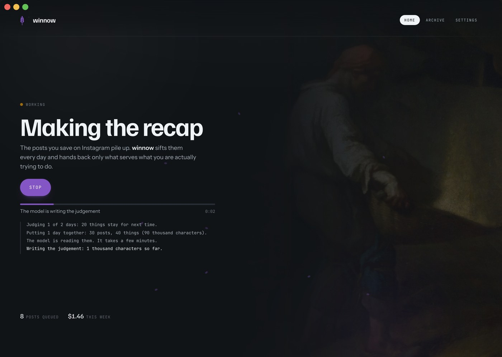
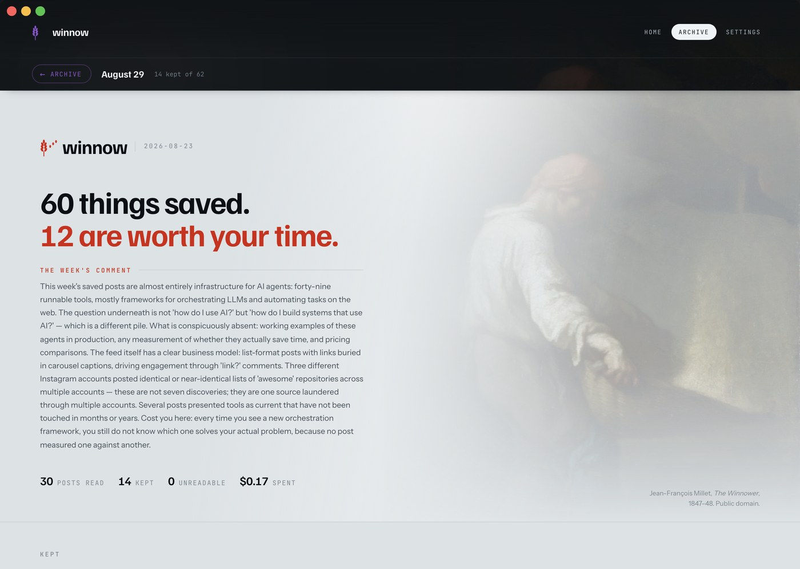
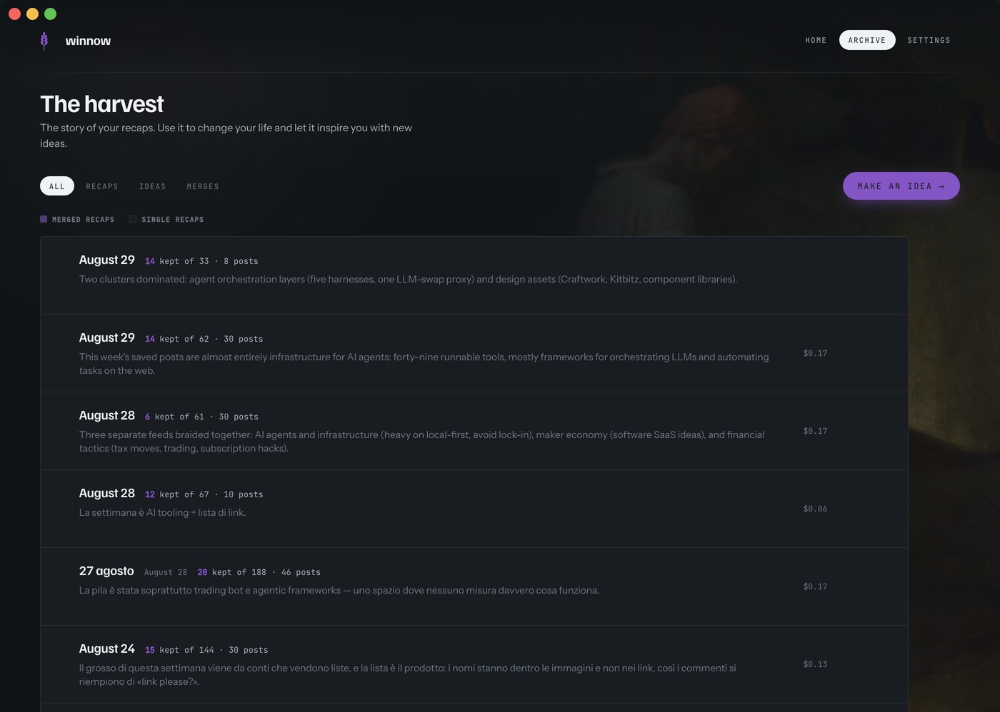
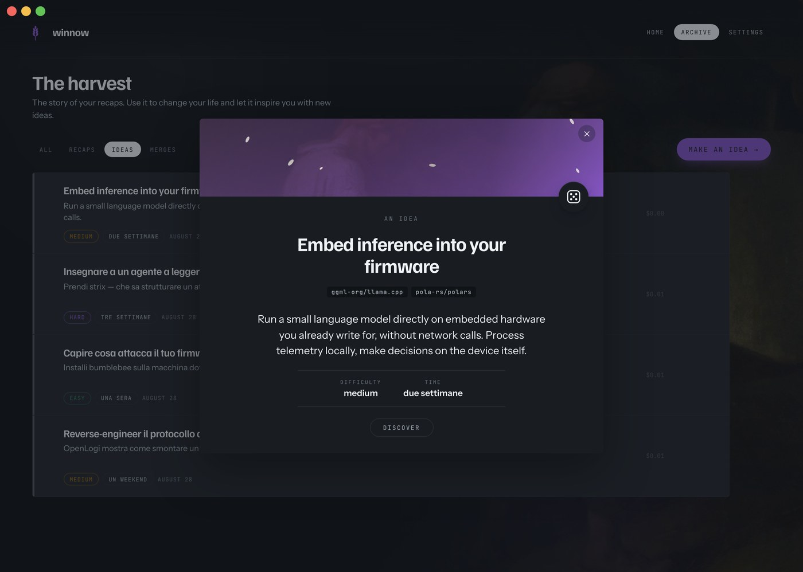
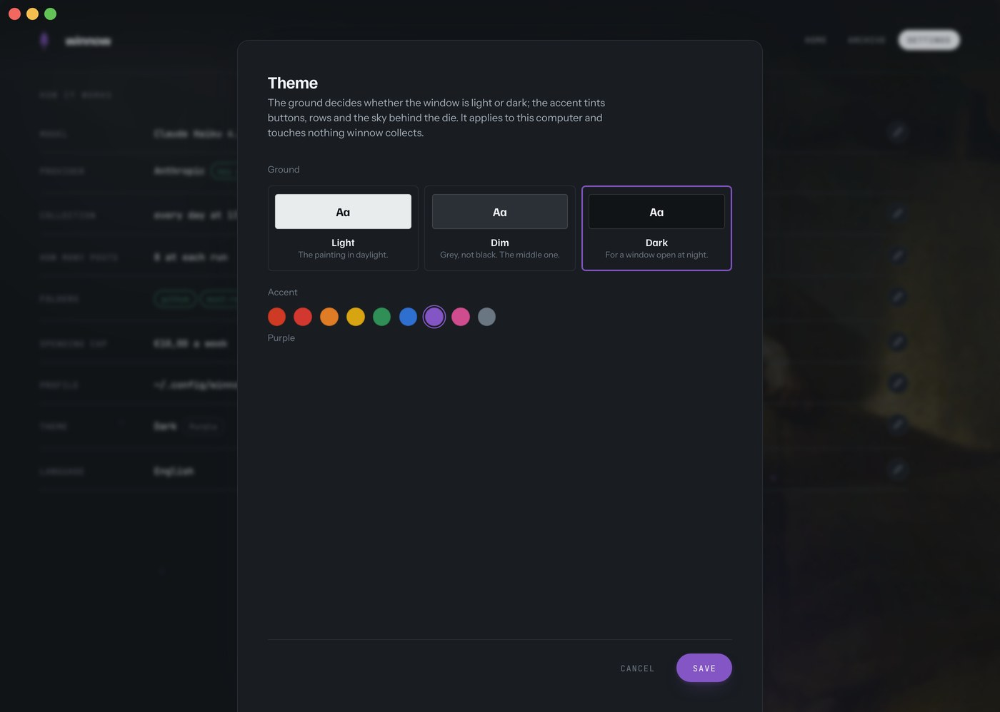

<div align="center">

# winnow

**The posts you save on Instagram pile up. winnow sifts them every day and hands
back only what serves what you are actually trying to do.**

[](LICENSE)
[](https://www.python.org/downloads/)
[](tests/)
[](CONTRIBUTING.md)


<sub>Jean-François Millet, <em>The Winnower</em>, c. 1847–48. National Gallery, London. Public domain.</sub>

</div>

<br>

You save a post and forget it. Once a day winnow opens the new ones, reads
**every slide of the carousel**, and checks each name it finds **at the
source** — GitHub, Hugging Face — so a beautiful post about a repo dead since
2024 stops looking like a live one. Once a week those facts meet **your
profile**, and what comes back is about you.

<p align="center"></p>

<br>

## The window

Everything below can be done from a terminal. Nobody wants to.

```bash
winnow app
```

That opens winnow in your browser, and it is the whole app: every screen in
this README is that page. If you would rather have it in the Dock, with its
own window and its own icon, build the shell — [how](#the-app-in-the-dock).

<p align="center"></p>

One screen, one sentence, one button — and one quiet way out of it. What the
button says is what there is to do: **Make the recap** when there is a pile
waiting, **Collect now** when there is not, **Sign back in** when Instagram has
closed the session, **Start again** when the spend brake stopped everything.

A run says what it is doing while it does it, because minutes of silence and a
crash look identical:

<p align="center"></p>

A bar that fills where there is a total to fill it with, a shuttle where there
is not — inventing a percentage is worse than admitting there is none — and a
clock ticking every second, which is the one thing that keeps moving while a
model writes. **Stop** stops it at the run's own checkpoints: between two
posts, before a model call. Never mid-request — a reply already on its way is a
reply already paid for.

<br>

## What it makes

Three things, and they are different on purpose.

### The recap — once a week, one command

<p align="center"></p>

The week's findings, your profile and the ask go to your model in one call. The
answer is saved before anything is built from it, then turned into a page and
opened. Nothing to copy, nothing to paste.

The page shows what got through — each with the slide you would have seen on
Instagram — and, under it, **every single thing that did not**, grouped by the
verdict that stopped it, with a count beside each. That last part is the one to
argue with: if *31 out of scope* looks wrong, you can see which 31.

> A backlog is cut into several recaps rather than sent as one. The answer
> carries a sentence per *rejected* thing, so its length tracks the pile and
> not what survived — and a recap covering a fortnight is a page nobody reads
> even when it fits.

### The merge — several recaps as one page

<p align="center"></p>

Tick two recaps or ten and press **Merge**. A thing kept twice appears once,
carrying both readings and both categories, with `2 recap` beside its name —
the one thing a merge can say that no single recap can. Nothing is re-judged
and nothing is dropped: merging arranges, it never weighs.

Everything in the archive can be given a name, and the date stays beside it.

### The idea — what any of it would do in your life

<p align="center"></p>

A README tells you what a thing *is*. **Make an idea** asks the question nobody
else can answer: *what would this change for me?* It draws a handful at random
out of everything winnow has ever kept — at random on purpose, because a judge
that starts from what matters most keeps landing on what you are already doing,
and an idea you already had is not an idea.

One idea per press. Three lines you can read at a glance, how hard it is and
how long it takes, and behind **Discover** the whole thing: how it would work,
what to try tonight, and what is weak about it. The die gives you another, for
about a cent. Things drawn before go to the back of the bag.

<br>

## Start to finish

### Once — about five minutes

```bash
pipx install git+https://github.com/stek765/winnow
winnow init
```

`pipx`, not `git clone`: cloning gives you the source, not the command. (Clone
it if you mean to change the code — then `pipx install --editable .`)

`winnow init` walks six steps and opens the pages you need on the way: **the
model** (an API key — Anthropic, OpenAI, or anything OpenAI-compatible on
localhost), **the browser** Playwright drives, **the Instagram login** (a real
window; you type it, the session is kept), **which saved folders** to follow,
**your `profile.md`**, and **the daily run**. → [the six steps in
detail](#the-six-steps)

> ⚠️ Step five is the one that decides everything. `profile.md` is what turns a
> pile of facts into a recap addressed to you — [what goes in
> it](#your-half--one-file-written-once).

### Every day — nothing

A scheduled job runs `winnow collect` at 13:00. It opens the posts you saved
since yesterday, reads **every slide** of each carousel, checks each name at
GitHub or Hugging Face, and writes one file into `findings/`. About **$0.008 a
post**, and it stops itself for good past €10 in a week.

Nothing to do. The home screen tells you it is alive; so does `winnow status`.

### Every week — one press

**Make the recap**, or `winnow recap` if you prefer the terminal.

If the network drops it waits and tries again — 5s, 15s, 45s, 120s — and says
so while it waits. If the key is dead it stops at once, because that one does
not fix itself.

<br>

## Your half — one file, written once

<table>
<tr>
<td width="50%"></td>
<td width="50%"></td>
</tr>
<tr>
<td valign="top">

**winnow's half — automatic.**

`you save` → `winnow collect` (once a day) → `findings/`

</td>
<td valign="top">

**Your half — one file.**

`winnow init` → write `profile.md` → press the button

</td>
</tr>
</table>

<details>
<summary><b>What actually goes to the model</b> — four blocks, in this order</summary>

<br>

| | | |
|---|---|---|
| **1. The week** | the facts | Every thing named in the posts you saved, merged into one entry each — what it is and who said so, what GitHub or Hugging Face answered, which posts named it, and what is shaky about it. Grouped by kind: code you can run, models, products, list entries, news, claims. |
| **2. How to read a pile like this** | `winnow/mentality.md` | The same file for everyone. A saved post is a question, not a vote; the caption is marketing and the source is a fact; a name repeated by one account is their letterhead. |
| **3. Who is reading** | your `profile.md` | Tints it. Does not drive it — which is why it comes *after* the facts and the mentality, and why a huge file here is a warning. |
| **4. What to produce** | `winnow/recap-prompt.md` | The ask, last, because in a long context the last thing read is the thing that gets done. |

Nothing else from the repo goes in. The daily `findings/*.json` files are the
source of block 1, but they are rearranged before they are handed over: dumped
raw, the same project appeared once per day and the facts were four times
larger than they needed to be.

</details>

<br>

## What happens inside a run

<picture>
  <source media="(prefers-color-scheme: dark)" srcset="assets/diagrams/winnow-pipeline-dark.png">
  
</picture>

> A click-bait post that happens to name a live repo with 37k stars is worth
> keeping.
>
> A beautifully made post listing repos dead for two years is not.

The caption never tells you which is which — the check does. winnow throws
nothing away on its own: it records what it found and what the source said, and
the deciding happens once a week, with your profile.

**A network failure, a rate limit and a genuine 404 are three different
outcomes**, and they are never collapsed into one. *Not checked* is not
*absent*, and neither is ever printed as *found*.

## What gets read

Only what you put in a folder — winnow never reads *All posts*, and it never
picks by content. Everything it skips, it skips mechanically:

| | |
|---|---|
| the folder is **on** | `active = true` in `config.toml`; `winnow init` lists them for you |
| **not seen before** | one pass per post, ever — even a failed one, so a broken post is never paid for twice |
| **8 per run** | `posts_per_run`, newest saved first |

The run is **shared between your folders**: one post from each in turn, until
it is full. A folder with nothing new hands its slot to the others, so
fairness never costs you a post. If you have more folders than slots, the
folder that has given the fewest posts so far goes first — so the ones that
missed out today are the ones served tomorrow.

### The first run, when you already have hundreds saved

Eight a day means a month of drip-feed, so clear the backlog deliberately:

```bash
winnow collect --posts 50
```

Money is not the constraint — 200 posts cost about **$0.90**, nowhere near the
weekly brake. **Time is**: GitHub allows 10 searches a minute anonymously, so
winnow waits 7s between checks. Give it a token and it waits 2s instead:

```bash
echo 'GITHUB_TOKEN=ghp_...' >> ~/.config/winnow/env    # any token, no scopes
```

That turns two hours of backlog into about forty minutes. The daily run keeps
its own cap either way.

<br>

## What it costs

Measured, not estimated — Claude Haiku, real runs:

| | |
|---|---|
| one post | **$0.005** |
| one full run (8 posts) | **$0.04** |
| a week of daily runs | **~$0.26** |
| one recap | **$0.06 – $0.20**, depending on how big the pile is |
| one idea | **~$0.01** |
| warning expense | `warn_eur_week = 3.0€` in `config.toml` |
| **max expense** | `halt_eur_week = 10.0€` — restart with `winnow reset-halt` |

Only posts you haven't seen are paid for, so a quiet week costs less. The brake
is not there to save money: a bill twenty times the estimate isn't a price, it's
a bug — a loop re-reading everything, a corrupt state file.

> ⚠️ Set a hard limit on the API key too, in the provider's console. The
> internal brake is policed by the same program that might contain the bug.

<br>

## Commands

The window does all of it. These are for when you would rather type.

| | |
|---|---|
| `winnow app` | the window |
| `winnow init` | set up, or fix whatever is missing |
| `winnow collect` | one pass now, instead of waiting for the next run |
| `winnow status` | is it alive, what did it find, what has it cost |
| `winnow recap` | the days not judged yet, judged and opened as a page |
| `winnow ideas` | a handful of everything kept, drawn at random, asked what one of them would change in your life |
| `winnow render` | a saved answer, turned into a page that opens itself |
| `winnow config` | change folders, model, posts per run, hour, profile |
| `winnow update` | pull the newest winnow, if there is one |
| `winnow reset-halt` | restart after the spend brake stopped it |

`winnow schedule --at 20:00 | --off`, `winnow login`, `winnow where` and
`winnow serve` are there too.

```console
$ winnow status                               (Example)
state        active
spend 7d     USD 0.5796
scheduled    every day at 13:00 (launchd)
posts seen   141
last run     21/08 16:19 (0h ago) — 126 posts, 351 entities, 122 verified
to read      2 file(s) in findings/  →  winnow recap
```

`status` speaks up on its own when the last run is over 36h old, when posts
failed, or when the brake stopped it.

### The app in the Dock

`winnow app` is enough, and needs nothing else. The desktop app is the same
page in a window of its own, and it is what the screenshots above were taken
in. Building it needs [Rust](https://rustup.rs) and the Tauri CLI:

```bash
cargo install tauri-cli --version "^2"
cd app/src-tauri && cargo tauri build
```

It writes a `.app` and a `.dmg` under `app/src-tauri/target/release/bundle/`.
Drag the `.app` into `/Applications` and that is it — there is nothing to
configure, because it configures nothing.

The shell owns almost nothing on purpose: it starts `winnow serve`, reads back
the port the OS handed it, and points a webview at that. Every decision — which
face the home screen wears, what a button does, what a run costs — stays in
Python, where it is tested offline. So the app never needs rebuilding when
winnow changes: `winnow update` is enough, and the window picks it up the next
time it opens.

> ⚠️ It looks for `winnow` in `~/.local/bin`, in the pipx venv, and in
> Homebrew's `bin` — an app launched from Finder inherits a PATH that has none
> of them. Install winnow first; the app is a window onto it, not a copy of it.

### Keeping it current

```bash
winnow update
```

⚠️ **`pipx upgrade winnow` does not work here, and does not say so.** It
compares version strings, the version does not move between commits, and it
answers *"already at latest version"* without fetching anything — `--force`
included. `winnow update` reads the commit it was built from, asks the remote
what it has, and reinstalls only when those differ. It also puts back anything
you had injected into the venv, which `pipx install --force` removes without a
word.

<br>

## Making it yours

<p align="center"></p>

Two axes: a **ground** (light, dim, dark) and an **accent** (nine).
Everything else — the pressed button, the merge rows, the sky behind the die —
is derived from those two, so all twenty-seven combinations work and none of
them is the one nobody checked. It is kept per installation, in
`~/.config/winnow/look.json`, and the engine writes it into the page it serves
so the window never opens in the wrong colour for a frame.

<br>

## Where things live

Nothing sits next to the code, so the command works from any directory.
`winnow where` prints the lot.

```
~/.config/winnow/
├── config.toml          your username and saved folders
├── profile.md           who you are — the judge reads this
├── look.json            ground and accent
└── env                  ANTHROPIC_API_KEY, mode 600

~/.local/share/winnow/
├── findings/2026-08-21.json    what a run found, one file per day
├── recap/
│   ├── 2026-08-21.answer.md    what the model answered, saved before it is read
│   ├── 2026-08-21.answer.html  the page
│   ├── idee-2026-08-21.*       a draw and the idea it produced
│   ├── unione-*.html           several recaps as one page
│   └── titles.json             names you gave them by hand
├── state/
│   ├── seen.json               posts already paid for
│   ├── judged.json             the last day already judged — recap picks up after it
│   ├── spend.json              the ledger
│   ├── collect.log             what the last runs did
│   └── HALTED                  present = stopped on spend
└── browser-profile/            its own Chromium session, not yours
```

All of it is gitignored, and a test enforces that no personal data reaches the
source. Saved posts never leave the machine except as slides sent to the
extraction model. Override the two roots with `XDG_CONFIG_HOME` /
`XDG_DATA_HOME`, or `WINNOW_CONFIG_DIR` / `WINNOW_DATA_DIR`.

<br>

---

<br>

## The six steps

`winnow init` is six numbered steps, in the only order they can happen in. Stop
whenever you like — re-running picks up where you left off.

| | | |
|---|---|---|
| 1 | the model | pick one from a menu, it opens the right console for the key |
| 2 | browser | downloads Chromium, once |
| 3 | Instagram login | opens a window, you sign in by hand |
| 4 | saved folders | reads them off your account, you pick which ones |
| 5 | **your profile** | four questions, one line each |
| 6 | daily run | launchd / systemd timer / cron |

**Step 1 is a menu**, because the model is a choice and not a config key you
should have to look up:

```
    1. Claude Haiku 4.5       cheapest, ~$0.005 a post — recommended
    2. Claude Sonnet 5        reads dense slides better, ~4x the cost
    3. OpenAI GPT-4o mini     if you already have an OpenAI account
    4. Your own model         Ollama, LM Studio, anything speaking the OpenAI API — free
```

Pick 1-3 and it opens that provider's key page and writes the key for you. Pick
4 and it asks for an address (`http://localhost:11434/v1`) and a model name —
anything that reads images and speaks the OpenAI API. **A local model costs
nothing**, and the spend ledger correctly records zero.

⚠️ A key with no credit on it is not a working key: load some before the first
run. If the model turns out to be unreachable, the run **stops** and marks
nothing as seen, so the queue is still there when you fix it.

**Step 5 takes a file you already wrote, if you have one.** Anyone keeping a
`CLAUDE.md`, an `AGENTS.md` or a notes file about themselves has already done
the work — `init` offers it:

```
    1. answer four questions (2 minutes)
    2. link ~/.claude/CLAUDE.md  (123 KB)
    3. link a file you already have (path)
    4. skip, I will write it later
```

Linking writes `@/path/to/file` into `profile.md` — a **reference, not a copy**,
so the profile follows the file as you edit it. If that file ever goes missing,
`winnow status` and `winnow recap` say so instead of quietly filtering with
nothing.

> ⚠️ **The bundle goes straight to your model provider's API.** So `init` and
> `recap` scan the profile for things shaped like credentials — API keys,
> tokens, private keys — and stop to ask. A personal notes file is exactly the
> kind of place where one is sitting forgotten.

**Step 5 is the one that matters** — the rest is plumbing. So `init` asks
instead of leaving you homework:

```
  Who are you, in two lines?
  What are you trying to get to in the next two or three years?
  What decisions do you have open right now?
  What have you already ruled out, and why?   ← the one that matters
```

An empty line skips a question. But a vague profile is a vague filter, and that
last question is what turns *"looks interesting"* into *"you ruled that out in
August"*.

Three things stay yours, because no code can do them: **creating the API key**
(set a spend limit while you're there), **signing in** — winnow never types your
password, and the session lives in a browser profile of its own — and **writing
the profile**, which is the whole point of the tool.

Scheduling picks itself: launchd on macOS, a systemd timer or cron on Linux. The
default is **13:00, not 3am**, and deliberately: collecting opens a browser
window, so it needs the machine awake, unlocked and with a graphical session.
Pick an hour that is true for you — `winnow schedule --at 20:00`.

## What is not done

Honest list, because a tool that filters other people's claims should not
oversell its own.

- **The judgement has been read over a handful of weeks, not a year.** How well
  a recap holds up over months, and whether merges stay useful as they grow, is
  something only time answers.
- **The profile has been written by one person so far.** The structure is meant
  to hold any set of interests, and `mentality.md` deliberately mentions no
  particular person — but "meant to" is not "shown to".
- **Instagram only.** Nothing in the collector assumes it forever, but nothing
  else is written.

## More

The recap prompt: [`winnow/recap-prompt.md`](winnow/recap-prompt.md), and the
ideas one beside it — both ship with the package, so the commands work without
a checkout. How to work on this: [`CLAUDE.md`](CLAUDE.md). Why it is built this
way: [`docs/superpowers/specs/`](docs/superpowers/specs/).

MIT — see [LICENSE](LICENSE).
