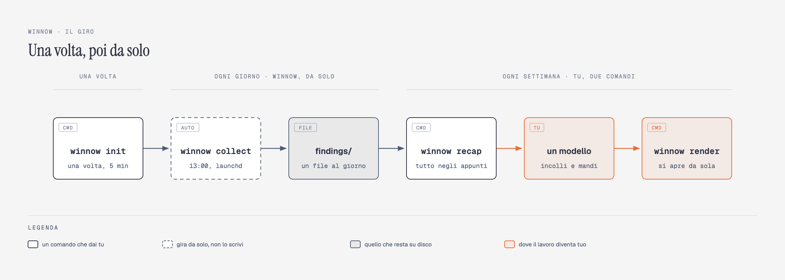

<div align="center">

# winnow

**You save a post on Instagram and forget it. winnow doesn't. Analytical tool to find, verify and resume what you need, aligned with your goals.**

[](LICENSE)
[](https://www.python.org/downloads/)
[](https://docs.pytest.org/)
[](CONTRIBUTING.md)


<sub>Jean-François Millet, <em>The Winnower</em>, c. 1847–48. National Gallery, London. Public domain.</sub>

</div>

<br>
<br>

## How it works

You save a post and forget it. Once a day winnow opens the new ones, reads
**every slide of the carousel**, and checks each name at the source. Once a week
those facts meet **your profile**, and what comes back is about you.

<p align="center"></p>

## What you actually do

<picture>
  <source media="(prefers-color-scheme: dark)" srcset="assets/diagrams/winnow-flow-dark.png">
  
</picture>

## Start to finish

### Once — about five minutes

```bash
pipx install git+https://github.com/stek765/winnow
winnow init
```

`pipx`, not `git clone`: cloning gives you the source, not the command. (Clone
it if you mean to change the code — then `pipx install --editable .`)

`winnow init` walks six steps and opens the pages you need on the way: **the
model** (an API key — Anthropic, OpenAI, or anything OpenAI-compatible on
localhost), **the browser** Playwright drives, **the Instagram login** (a real
window; you type it, the session is kept), **which saved folders** to follow,
**your `profile.md`**, and **the daily run**. → [the six steps in
detail](#info)

> ⚠️ Step five is the one that decides everything. `profile.md` is what turns a
> pile of facts into a recap addressed to you — [what goes in it](#once-a-week).

### Every day — nothing

A launchd job runs `winnow collect` at 13:00. It opens the posts you saved
since yesterday, reads **every slide** of each carousel, checks each name at
GitHub or Hugging Face, and writes one file into `findings/`. About **$0.008 a
post**, and it stops itself for good past €10 in a week.

Nothing to do. `winnow status` tells you it is alive.

### Every week — one command

```bash
winnow recap
```

It bundles the days you have not judged yet, sends them to your model, and
opens the page. Nothing to copy, nothing to paste.

If the network drops it waits and tries again — 5s, 15s, 45s, 120s — and says
so while it waits. If the key is dead it stops at once, because that one does
not fix itself.

The page shows what got through — each with the slide you would have seen on
Instagram — and, under it, **every single thing that did not**, grouped by the
verdict that stopped it, with the count beside each. That last part is the one
to argue with: if *31 out of scope* looks wrong, you can see which 31.

`winnow render answer.md` still turns a saved answer into a page, for when you
want to fix one by hand.

### Keeping it current

```bash
winnow update
```

⚠️ **`pipx upgrade winnow` does not work here, and does not say so.** It
compares version strings, the version does not move between commits, and it
answers *"already at latest version"* without fetching anything — `--force`
included. `winnow update` reads the commit it was built from, asks the remote
what it has, and reinstalls only when those differ. It also puts back anything
you had injected into the venv, which `pipx install --force` removes without a
word.

## Commands

Eight. Everything else `init` does for you.

| | |
|---|---|
| `winnow init` | set up, or fix whatever is missing |
| `winnow collect` | one pass now, instead of waiting for the next run |
| `winnow status` | is it alive, what did it find, what has it cost |
| `winnow recap` | the week judged and opened as a page — one command |
| `winnow render` | a saved answer, turned into a page that opens itself |
| `winnow config` | change folders, model, posts per run, hour, profile |
| `winnow update` | pull the newest winnow, if there is one |
| `winnow reset-halt` | restart after the spend brake stopped it |


<br>
<br>

---

<br>

```console
$ winnow status                               (Example)
state        active
spend 7d     USD 0.5796
scheduled    every day at 13:00 (launchd)
posts seen   141
last run     21/08 16:19 (0h ago) — 126 posts, 351 entities, 122 verified
to read      2 file(s) in findings/  →  winnow recap
```

`status` speaks up on its own when the last run is over 36h old, when posts
failed, or when the brake stopped it.

`winnow schedule --at 20:00 | --off`, `winnow login` and `winnow where` are
still there for when you want them directly.

## Once a week

<table>
<tr>
<td width="50%"></td>
<td width="50%"></td>
</tr>
<tr>
<td valign="top">

**winnow's half — automatic.**

`you save` → `winnow collect` (once a day) → `findings/`

</td>
<td valign="top">

**Your half — one file, written once.**

`winnow init` → rewrite `profile.md` → `winnow recap`

</td>
</tr>
</table>

### `winnow recap` sends the prompt, your profile and the week's findings to your model, and judges the week in one call.

The answer is saved to `recap/` before anything is built from it, then turned
straight into the page and opened. Nothing to copy, nothing to paste, nothing
lost if a browser tab was already closed.

<details>
<summary><b>What actually goes to the model</b> — four blocks, in this order</summary>

<br>

| | | |
|---|---|---|
| **1. The week** | the facts | Every thing named in the posts you saved, merged into one entry each — what it is and who said so, what GitHub or Hugging Face answered, which posts named it, and what is shaky about it. Grouped by kind: code you can run, models, products, list entries, news, claims. |
| **2. How to read a pile like this** | `winnow/mentality.md` | The same file for everyone. A saved post is a question, not a vote; the caption is marketing and the source is a fact; a name repeated by one account is their letterhead. |
| **3. Who is reading** | your `profile.md` | Tints it. Does not drive it — which is why it comes *after* the facts and the mentality, and why a huge file here is a warning. |
| **4. What to produce** | `winnow/recap-prompt.md` | The ask, last, because in a long context the last thing read is the thing that gets done. |

Nothing else from the repo goes in. The daily `findings/*.json` files are the
source of block 1, but they are rearranged before they are handed over: dumped
raw, the same project appeared once per day and the facts were four times
larger than they needed to be.

</details>

<br>

## What happens inside a run

<picture>
  <source media="(prefers-color-scheme: dark)" srcset="assets/diagrams/winnow-pipeline-dark.png">
  
</picture>

> A click-bait post that happens to name a live repo with 37k stars is worth
> keeping.
>
> A beautifully made post listing repos dead for two years is not.

The caption never tells you which is which — the check does. winnow throws
nothing away on its own: it records what it found and what the source said, and
the deciding happens once a week, [with your profile](#once-a-week).

## What gets read

Only what you put in a folder — winnow never reads *All posts*, and it never
picks by content. Everything it skips, it skips mechanically:

| | |
|---|---|
| the folder is **on** | `active = true` in `config.toml`; `winnow init` lists them for you |
| **not seen before** | one pass per post, ever — even a failed one, so a broken post is never paid for twice |
| **8 per run** | `posts_per_run`, newest saved first |

Folders are read **in config order**, and the cap applies to the whole queue:
a folder with a big backlog can starve the ones below it for a few days.
Reorder the `[[folders]]` blocks to change who goes first.

### The first run, when you already have hundreds saved

Eight a day means a month of drip-feed, so clear the backlog deliberately:

```bash
winnow collect --posts 50
```

Money is not the constraint — 200 posts cost about **$0.90**, nowhere near the
weekly brake. **Time is**: GitHub allows 10 searches a minute anonymously, so
winnow waits 7s between checks. Give it a token and it waits 2s instead:

```bash
echo 'GITHUB_TOKEN=ghp_...' >> ~/.config/winnow/env    # any token, no scopes
```

That turns two hours of backlog into about forty minutes. The daily run keeps
its own cap either way.

## What it costs

Measured, not estimated — two runs of 8 posts, 20 and 21 August, Claude Haiku:

| | |
|---|---|
| one post | **$0.0046** |
| one full run (8 posts) | **$0.037** |
| a week of daily runs | **~$0.26** |
| warning expense | `warn_eur_week = 3.0€` in `config.toml` |
| **max expense** | `halt_eur_week = 10.0€` — restart with `winnow reset-halt` |

Only posts you haven't seen are paid for, so a quiet week costs less. The brake
is not there to save money: a bill twenty times the estimate isn't a price, it's
a bug — a loop re-reading everything, a corrupt state file.

> ⚠️ Set a hard limit on the API key too, in the provider's console. The
> internal brake is policed by the same program that might contain the bug.

<br>

## Where things live

Nothing sits next to the code, so the command works from any directory.
`winnow where` prints the lot.

```
~/.config/winnow/
├── config.toml          your username and saved folders
├── profile.md           who you are — the judge reads this
└── env                  ANTHROPIC_API_KEY, mode 600

~/.local/share/winnow/
├── findings/2026-08-21.json    what a run found, one file per day
├── recap/2026-08-21.answer.md  what the model answered, saved before it is read
├── state/
│   ├── seen.json               posts already paid for
│   ├── judged.json             the last day already judged — recap picks up after it
│   ├── spend.json              the ledger
│   ├── collect.log             what the last runs did
│   └── HALTED                  present = stopped on spend
└── browser-profile/            its own Chromium session, not yours
```

All of it is gitignored, and a test enforces that no personal data reaches the
source. Saved posts never leave the machine except as slides sent to the
extraction model. Override the two roots with `XDG_CONFIG_HOME` /
`XDG_DATA_HOME`, or `WINNOW_CONFIG_DIR` / `WINNOW_DATA_DIR`.


---

<br>

## Info

`winnow init` is six numbered steps, in the only order they can happen in. Stop
whenever you like — re-running picks up where you left off.

| | | |
|---|---|---|
| 1 | the model | pick one from a menu, it opens the right console for the key |
| 2 | browser | downloads Chromium, once |
| 3 | Instagram login | opens a window, you sign in by hand |
| 4 | saved folders | reads them off your account, you pick which ones |
| 5 | **your profile** | four questions, one line each |
| 6 | daily run | launchd / systemd timer / cron |

**Step 1 is a menu**, because the model is a choice and not a config key you
should have to look up:

```
    1. Claude Haiku 4.5       cheapest, ~$0.005 a post — recommended
    2. Claude Sonnet 5        reads dense slides better, ~4x the cost
    3. OpenAI GPT-4o mini     if you already have an OpenAI account
    4. Your own model         Ollama, LM Studio, anything speaking the OpenAI API — free
```

Pick 1-3 and it opens that provider's key page and writes the key for you. Pick
4 and it asks for an address (`http://localhost:11434/v1`) and a model name —
anything that reads images and speaks the OpenAI API. **A local model costs
nothing**, and the spend ledger correctly records zero.

⚠️ A key with no credit on it is not a working key: load some before the first
run. If the model turns out to be unreachable, the run **stops** and marks
nothing as seen, so the queue is still there when you fix it.

**Step 5 takes a file you already wrote, if you have one.** Anyone keeping a
`CLAUDE.md`, an `AGENTS.md` or a notes file about themselves has already done
the work — `init` offers it:

```
    1. answer four questions (2 minutes)
    2. link ~/.claude/CLAUDE.md  (123 KB)
    3. link a file you already have (path)
    4. skip, I will write it later
```

Linking writes `@/path/to/file` into `profile.md` — a **reference, not a copy**,
so the profile follows the file as you edit it. If that file ever goes missing,
`winnow status` and `winnow recap` say so instead of quietly filtering with
nothing.

> ⚠️ **The bundle goes straight to your model provider's API.** So `init` and
> `recap` scan the profile for things shaped like credentials — API keys,
> tokens, private keys — and stop to ask. A personal notes file is exactly the
> kind of place where one is sitting forgotten.

**Step 5 is the one that matters** — the rest is plumbing. So `init` asks
instead of leaving you homework:

```
  Who are you, in two lines?
  What are you trying to get to in the next two or three years?
  What decisions do you have open right now?
  What have you already ruled out, and why?   ← the one that matters
```

An empty line skips a question. But a vague profile is a vague filter, and that
last question is what turns *"looks interesting"* into *"you ruled that out in
August"*.

Three things stay yours, because no code can do them: **creating the API key**
(set a spend limit while you're there), **signing in** — winnow never types your
password, and the session lives in a browser profile of its own — and **writing
the profile**, which is the whole point of the tool.

Scheduling picks itself: launchd on macOS, a systemd timer or cron on Linux. The
default is **13:00, not 3am**, and deliberately: collecting opens a browser
window, so it needs the machine awake, unlocked and with a graphical session.
Pick an hour that is true for you — `winnow schedule --at 20:00`.

## More

The recap prompt: [`winnow/recap-prompt.md`](winnow/recap-prompt.md) — it ships
with the package, so `winnow recap` works without a checkout.
Why it is built this way: [`docs/superpowers/specs/`](docs/superpowers/specs/).

MIT — see [LICENSE](LICENSE).
